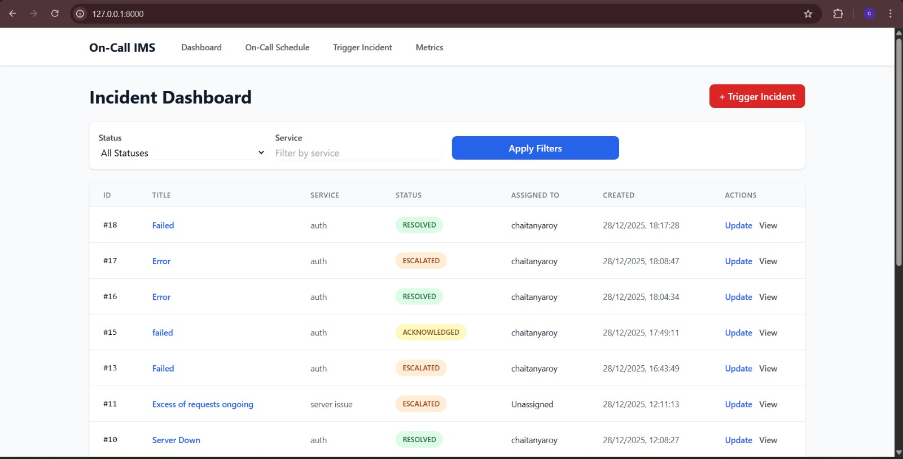
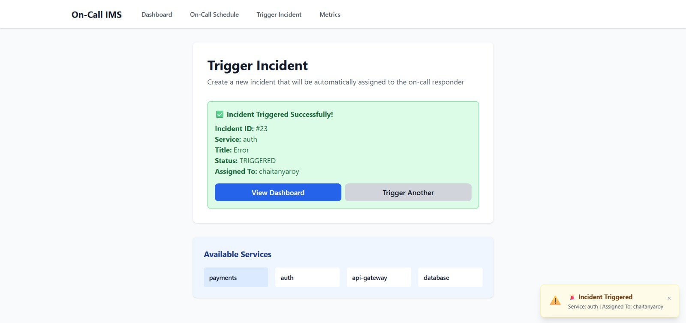
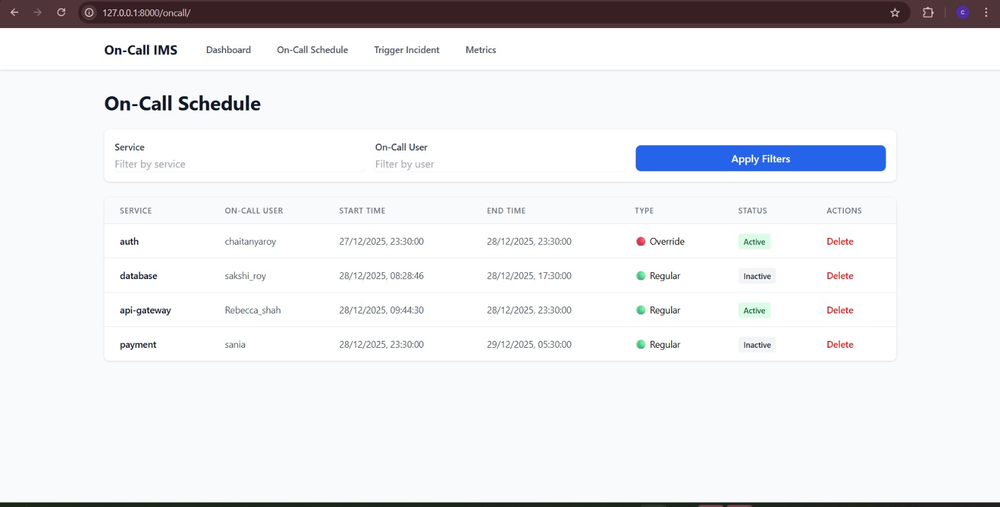
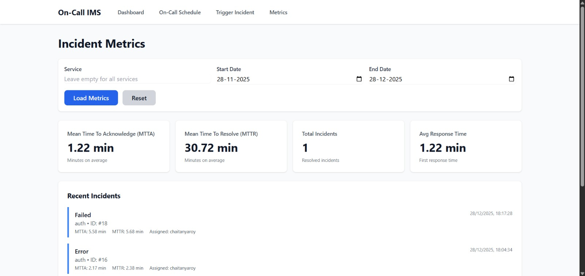
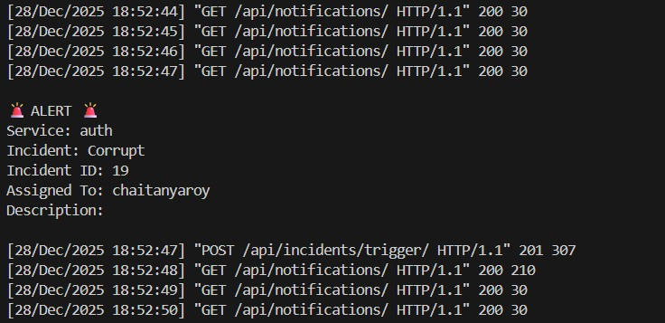
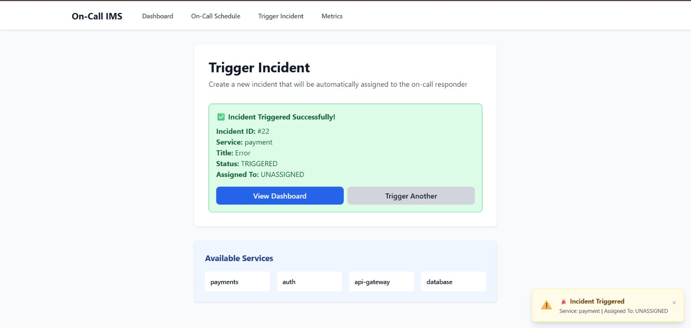
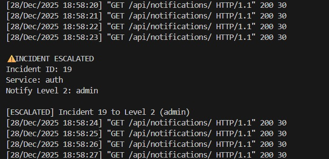
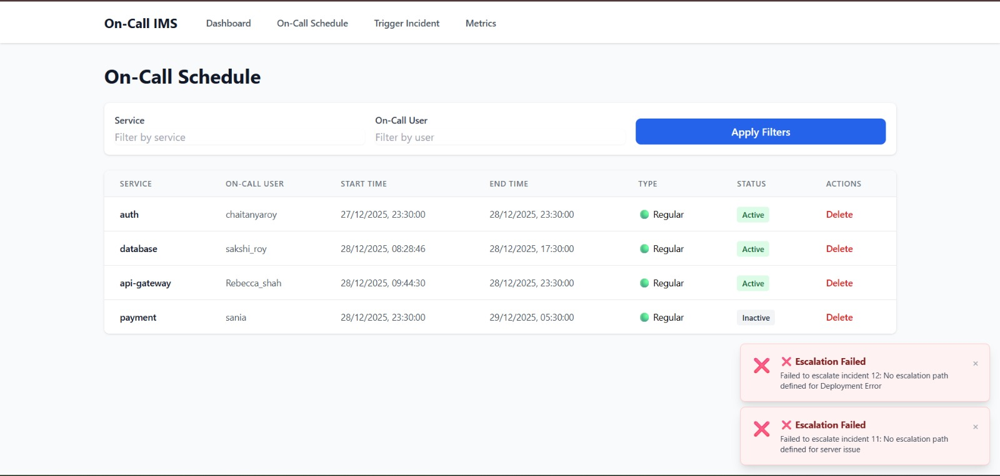
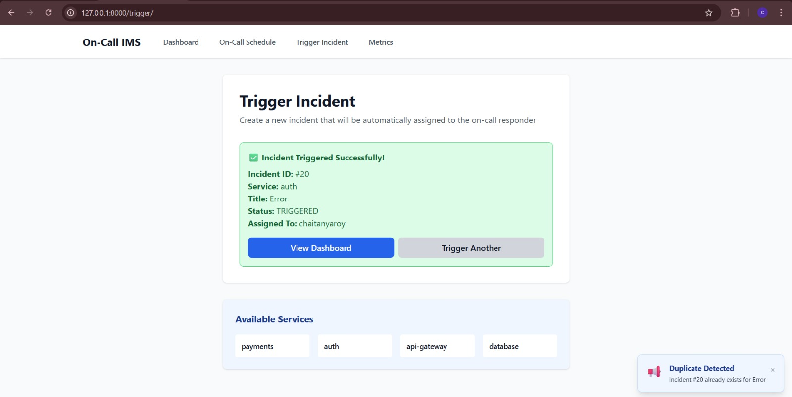

# On-Call Incident Management System

A focused incident response platform demonstrating core PagerDuty-like mechanics: on-call scheduling, incident routing, escalation, and lifecycle management.

**Design Philosophy**: Prioritize correctness and clarity over scale. Intentionally minimal feature set to showcase clean system design and edge-case reasoning.

---

## Demo Video

[Watch the full demo here](https://drive.google.com/file/d/1wERBxuXZ4gGOui4p5a-5uHGY21JoKDdm/view?usp=drivesdk)

This video demonstrates:
- Creating incidents via API
- Auto-assignment to on-call responders
- Acknowledging and resolving incidents
- Automatic escalation after 5 minutes
- Real-time UI updates and notifications
- Metrics dashboard (MTTA/MTTR)

**📖 For a detailed reflection on the design decisions and challenges faced, see [Experience.md](./Experience.md)**

---

## Project Overview

### Problem Solved

When a critical service fails (e.g., database outage, payment processing down), the system must:
1. Identify who is currently on-call for that service
2. Alert them immediately
3. Track acknowledgement and resolution
4. Escalate if unaddressed within a defined window

This project implements exactly that—nothing more, nothing less.

### Intentionally Kept Minimal

- **No authentication**: Focus on incident logic, not auth
- **No email/SMS**: Alerts via console logs; UI polls for updates
- **No distributed architecture**: Single SQLite database
- **No UI forms for scheduling**: Schedules managed only via admin portal
- **No real-time WebSockets**: Simple polling (10s refresh)

---

## High-Level Architecture

### Backend (Django + DRF)

**Responsibility**: Business logic for scheduling, incident management, and escalation.

- **Models**: `OnCallSchedule`, `Incident`, `EscalationLevel`
- **Service Layer**: `OnCallService`, `IncidentService` encapsulate all business rules
- **API Layer**: Thin REST views that delegate to services
- **Scheduler**: APScheduler background job checks escalations every 60 seconds

**Key Design Decision**: All business logic lives in services, not views. Views are dumb request/response handlers.

### Frontend (HTML + Tailwind CSS + Vanilla JS)

**Responsibility**: Display incidents, allow state transitions, poll for updates.

- **Dashboard**: View incidents, filter by status/service, acknowledge, resolve
- **Trigger**: Create incidents via API
- **On-Call View**: View current schedules (read-only)
- **Metrics**: Display MTTA/MTTR aggregates

**Key Decision**: No business logic in JS. All state validation happens server-side.

#### Frontend screenshots

Incident Dashboard: 

Incident Triggered: 

On-Call Schedule: 

Metrics: 


### Alerts (Console Only)

Alerts print to stdout when:
- Incident triggered: `🚨 ALERT 🚨 Service: X, Incident ID: Y, Assigned To: Z`
- Incident acknowledged: `✅ Incident acknowledged`
- Incident escalated: `⚠️ INCIDENT ESCALATED`



In production, these would be HTTP POST calls to Slack/PagerDuty APIs. Here, they're console logs + UI toast notifications.

---

## Core Features & Implementation Logic

### 1. On-Call Scheduling

**Model**: `OnCallSchedule(service_name, user, start_time, end_time, is_override)`

**Logic** (`OnCallService.get_on_call_user`):
```
1. Query schedules for given service
2. Find where: start_time ≤ now ≤ end_time
3. If multiple match: prioritize is_override=True, then earliest created_at
4. If none match: return None
```

**Edge Cases**:
- Schedule crossing midnight: Handled via simple datetime comparison (not date boundaries)
- Overlapping schedules: Override flag breaks ties deterministically
- No on-call user: Incident created but unassigned; UI shows "UNASSIGNED"



### 2. Incident Triggering

**Endpoint**: `POST /api/incidents/trigger/`

**Flow**:
```
1. Receive: service_name, title, description
2. Check deduplication: same service + title within 5 mins?
   → YES: increment counter, return existing incident
   → NO: create new incident
3. Lookup on-call user for service
4. Auto-assign incident
5. Log alert to console & UI notification
6. Return incident ID
```

**Why deduplication?**: Prevents alert storms if a monitoring tool fires the same alert repeatedly.

### 3. On-Call Resolution (State Transitions)

**Allowed Transitions**:

| From         | To            | Allowed? | Why |
|--------------|---------------|----------|-----|
| TRIGGERED    | ACKNOWLEDGED  | ✅       | Happy path |
| TRIGGERED    | ESCALATED     | ✅       | Timeout |
| ACKNOWLEDGED | RESOLVED      | ✅       | Responder fixed it |
| RESOLVED     | *             | ❌       | Terminal state |
| ACKNOWLEDGED | TRIGGERED     | ❌       | Can't revert |
| TRIGGERED    | RESOLVED      | ❌       | Can't jump states |


**Enforcement**: `IncidentService` methods check current status before allowing transition. Invalid transitions raise `ValueError`.

### 4. Escalation Mechanism

**Trigger**: APScheduler runs `check_escalations()` every 60 seconds.

**Logic**:
```
For each incident where status=TRIGGERED:
  if (now - created_at) > 5 minutes:
    1. Query EscalationLevel for service
    2. If exists: transition to ESCALATED, log alert
    3. If not: log "No escalation path defined"
```

**Why 5 minutes?**: Arbitrary but reasonable SLA window. Configurable.

**User Reassignment**: No longer reassigns to escalation user (removed for simplicity). Escalation is now a flag indicating "unhandled for too long."

⚠️ Escalation example: 

❌ Missing escalation path: 

### 5. Incident Deduplication

**Mechanism**: Before creating incident, query for existing within 5-min window.

```sql
SELECT * FROM incident 
WHERE service_name = X 
  AND title = Y 
  AND created_at > (now - 5 mins)
  AND status IN (TRIGGERED, ACKNOWLEDGED)
```

**Return**: If found, return existing; else create new.



### 6. Metrics

**MTTA** (Mean Time to Acknowledge):  
`acknowledged_at - created_at` (average across resolved incidents)

**MTTR** (Mean Time to Resolve):  
`resolved_at - created_at` (average across resolved incidents)

**Endpoint**: `GET /api/metrics/` returns:
```json
{
  "total_incidents": 42,
  "mtta_seconds": 120,
  "mttr_seconds": 1800,
  "resolved_incidents": 30
}
```

---

## Incident Lifecycle

```
TRIGGERED
    ↓ (user acknowledges)
ACKNOWLEDGED
    ↓ (user resolves)
RESOLVED

TRIGGERED
    ↓ (5 mins pass, no acknowledgement)
ESCALATED
    ↓ (after escalation, still open)
ESCALATED (no further transitions)
```

**Key Invariant**: Once in RESOLVED, no further transitions allowed.

---

## API Overview

### POST `/api/incidents/trigger/`
Create and auto-assign incident.

**Request**:
```json
{
  "service_name": "payments",
  "title": "DB connection failed",
  "description": "Timeout on primary DB"
}
```

**Response**: `201 Created`
```json
{
  "id": 5,
  "status": "TRIGGERED",
  "assigned_to": "alice",
  "created_at": "2025-12-28T08:00:00Z"
}
```

### PUT `/api/incidents/{id}/acknowledge/`
Mark incident acknowledged by responder.

### PUT `/api/incidents/{id}/resolve/`
Mark incident resolved.

### POST `/api/incidents/escalate/check/`
Manually trigger escalation check (also runs automatically via APScheduler).

### GET `/api/incidents/list/all/`
Fetch all incidents (dashboard uses this with polling).

### GET `/api/metrics/`
Get MTTA/MTTR metrics.

---

## Edge Cases Considered

| Case | Handling |
|------|----------|
| **No on-call user** | Incident created, assigned_to=NULL, UI shows "UNASSIGNED" |
| **Duplicate trigger** | Deduplication window catches within 5 mins; increments counter |
| **Late acknowledgement** | If acknowledged after escalation, status remains ACKNOWLEDGED (no reversal) |
| **Overlapping schedules** | is_override=True takes priority; otherwise earliest wins |
| **Invalid transitions** | API returns 400 Bad Request with error message |
| **Escalation without path** | Logs error, sends UI notification, incident remains ESCALATED |
| **Clock skew** | Django's timezone.now() always used; no client-side time logic |

---

## Setup & Run

### Prerequisites
- Python 3.10+
- pip

### Install

```bash
# Clone and enter directory
git clone <repo>
cd incident-management-system-main

# Create virtual environment
python -m venv venv
source venv/bin/activate  # Windows: venv\Scripts\activate

# Install dependencies
pip install -r requirements.txt

# Run migrations
python manage.py migrate

# Create superuser (for admin portal)
python manage.py createsuperuser

# Start development server
python manage.py runserver
```

### Access

- **Dashboard**: http://localhost:8000/
- **Trigger Incident**: http://localhost:8000/trigger/
- **On-Call Schedules**: http://localhost:8000/oncall/
- **Metrics**: http://localhost:8000/metrics/
- **Admin Portal**: http://localhost:8000/admin/ (manage schedules, escalation levels)

### Run Tests

```bash
python manage.py test incidents -v 2
```

All 19 tests pass, covering:
- On-call lookup (4 tests)
- Incident CRUD and state transitions (10 tests)
- Escalation logic (2 tests)
- Metrics calculation (4 tests)

---

## Limitations & Future Improvements

### Intentionally Not Implemented

- **Authentication & Authorization**: All endpoints public; in production, would add JWT/OAuth
- **Real-time Alerts**: No WebSockets; UI polls every 10 seconds
- **Multi-tenancy**: Single org assumed
- **Audit Logs**: No historical tracking of who changed what when
- **Incident Comments**: No conversation thread on incidents
- **Bulk Operations**: No batch acknowledge/resolve

### What Would Change with More Time

1. **Celery**: Replace APScheduler with async task queue for reliability
2. **PostgreSQL**: SQLite works for learning; scale requires proper DB
3. **API Auth**: Token-based API for external systems (monitoring tools)
4. **Webhook Callbacks**: Notify external systems when incident resolves
5. **UI State Management**: React/Vue for cleaner complex state
6. **Observability**: Prometheus metrics, structured logging, tracing
7. **Configuration**: Environment-based SLA windows, alert channels
8. **Testing**: Integration tests with real database, load testing


---

## Code Structure

```
incidents/
  ├── models.py          # Incident, OnCallSchedule, EscalationLevel
  ├── services.py        # OnCallService, IncidentService (core logic)
  ├── views.py           # REST API endpoints
  ├── serializers.py     # DRF serializers
  ├── notifications.py   # Notification service
  ├── scheduler.py       # APScheduler background jobs
  ├── admin.py           # Django admin customization
  └── tests.py           # 19 unit + integration tests

templates/
  ├── base.html          # Base template with nav
  ├── dashboard.html     # Incident list & filters
  ├── trigger.html       # Create incident form
  ├── oncall.html        # View schedules
  └── metrics.html       # MTTA/MTTR display

static/js/
  ├── dashboard.js       # Incident dashboard logic
  ├── trigger.js         # Trigger form submission
  ├── oncall.js          # Schedule table refresh
  ├── metrics.js         # Metrics polling
  └── notifications.js   # Toast notifications
```

---


